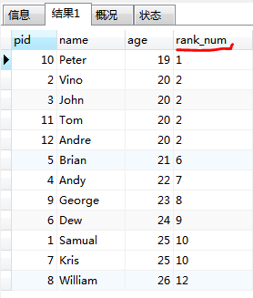
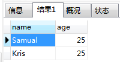
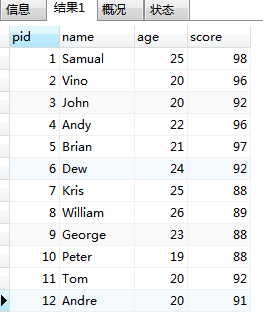
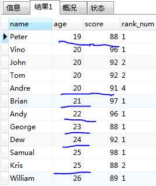

mysql之窗口函数

MySQL从8.0开始支持开窗函数，也叫分析函数

CREATE TABLE `players` (
`pid` int(2) NOT NULL AUTO_INCREMENT,
`name` varchar(50) NOT NULL,
`age` int(2) NOT NULL,
PRIMARY KEY (`pid`),
UNIQUE KEY `name` (`name`)
) ENGINE=InnoDB  DEFAULT CHARSET=latin1;

INSERT INTO `players` (`pid`, `name`, `age`) VALUES
(1, 'Samual', 25),
(2, 'Vino', 20),
(3, 'John', 20),
(4, 'Andy', 22),
(5, 'Brian', 21),
(6, 'Dew', 24),
(7, 'Kris', 25),
(8, 'William', 26),
(9, 'George', 23),
(10, 'Peter', 19),
(11, 'Tom', 20),
(12, 'Andre', 20);

rank over(order by 列名)
1、 按age升序给运动员排名

select pid,name,age,rank() over(order by age) as rank_num
from players;

2、查询排名为第10的学生的姓名，年龄

select name,age
from (select pid,name,age,rank() over(order by age) as rank_num from players) as rank_table --临时表rank_table
where rank_num= 10;

rank over(partition by 列名,order by 列名)
partition by用于给结果集分组。
rank在每个分组内进行排名。

alter table players
add score int;

update players set score=98 where pid=1;
update players set score=96 where pid=2;
update players set score=92 where pid=3;
update players set score=96 where pid=4;
update players set score=97 where pid=5;
update players set score=92 where pid=6;
update players set score=88 where pid=7;
update players set score=89 where pid=8;
update players set score=88 where pid=9;
update players set score=88 where pid=10;
update players set score=92 where pid=11;
update players set score=91 where pid=12;

select * from players;

1、按年龄分组，组内按分数降序排名

select name,age,score,rank() over(partition by age order by score desc) as rank_num
from players;

3、dense_rank() over(业务逻辑)

作用：查出指定条件后的进行排名，条件相同排名相同，排名间断不连续。

说明：和rank() over 的作用相同，区别在于dense_rank() over 排名是密集连续的。例如运动员排名，使用这个函数，成绩相同的两名是并列，下一位同学接着下一个名次。即：1 2 2 2 2 3 而不是rank() over 到了1 2 2 2 2 6

4、row_number() over(业务逻辑)

作用：查出指定条件后的进行排名，条件相同排名也不相同，排名间断不连续。

说明：这个函数不需要考虑是否并列，即使根据条件查询出来的数值相同也会进行连续排序。即：1 2 3 4 5 6

5、lag() over()

Lag()就是取当前顺序的上一行记录。结合over就是分组统计数据的。
Lag()函数，就是去上N行的字段的数据。

SQL> select * from x;

A
----------
1
2
3
5

SQL> select a as snaped,
lag(a, 2) OVER(ORDER BY a) as snapst
from x;

SNAPED SNAPST
---------- ----------
1
2
3 1
5 2

SQL>

6、lead() over()

LEAD()函数是一个窗口函数，允许您向前看多行并从当前行访问行的数据。
与LAG()函数类似，LEAD()函数对于计算同一结果集中当前行和后续行之间的差异非常有用。

lag是读取前一行，lead是读取后一行的

以下语句查找每个客户的订单日期和下一个订单日期：
SELECT
customerName,
orderDate,
LEAD(orderDate,1) OVER (
PARTITION BY customerNumber
ORDER BY orderDate ) nextOrderDate
FROM
orders
INNER JOIN customers USING (customerNumber);

+------------------------------------+------------+---------------+
| customerName                       | orderDate  | nextOrderDate |
+------------------------------------+------------+---------------+
| Atelier graphique                  | 2013-05-20 | 2014-09-27    |
| Atelier graphique                  | 2014-09-27 | 2014-11-25    |
| Atelier graphique                  | 2014-11-25 | NULL          |
| Signal Gift Stores                 | 2013-05-21 | 2014-08-06    |
| Signal Gift Stores                 | 2014-08-06 | 2014-11-29    |
| Signal Gift Stores                 | 2014-11-29 | NULL          |
| Australian Collectors, Co.         | 2013-04-29 | 2013-05-21    |
| Australian Collectors, Co.         | 2013-05-21 | 2014-02-20    |
| Australian Collectors, Co.         | 2014-02-20 | 2014-11-24    |
| Australian Collectors, Co.         | 2014-11-24 | 2014-11-29    |
| Australian Collectors, Co.         | 2014-11-29 | NULL          |
| La Rochelle Gifts                  | 2014-07-23 | 2014-10-29    |
| La Rochelle Gifts                  | 2014-10-29 | 2015-02-03    |
| La Rochelle Gifts                  | 2015-02-03 | 2015-05-31    |
| La Rochelle Gifts                  | 2015-05-31 | NULL          |
| Baane Mini Imports                 | 2013-01-29 | 2013-10-10    |
| Baane Mini Imports                 | 2013-10-10 | 2014-10-15    |

7、sum() over()

select * from test

v1  v2
aa 60
aa 61
aa 62
bb 60

按照 v2 排序，累计 n+n-1+....+1

select v1,v2,sum(v2) over(order by v2) as sum
from test;

v1 v2 sum
aa 60 60
bb 60 120
aa 61 181
aa 62 243

select v1,v2,sum(v2) over(partition by v1 order by v2) as sum
from test;

v1  v2  sum
aa  60  60
aa  61  121
aa  62  183
bb  60  60